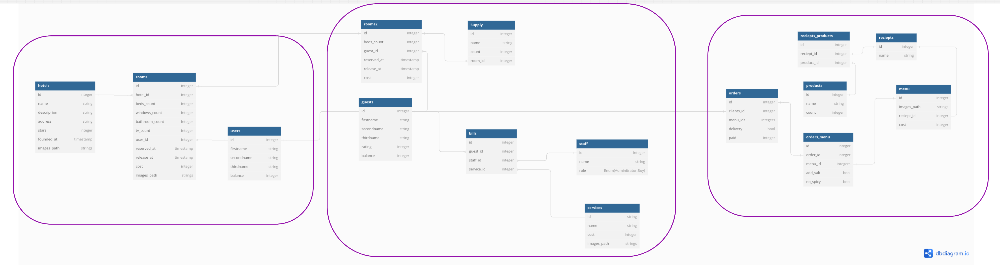

# Тема «Проектирование архитектуры системы управления сетью отелей по всему миру»

## Функциональные требования.

- Система должна позволять искать, бронировать номера;
- регистрироваться в отеле, финализировать счет;
- заказывать услуги в номер, в том числе из ресторана.

## Нефункциональные требования

- Отказоустойчивость на уровне 99.999;
- Система должна быть устойчива к десятикратному повышению нагрузки в течение суток;
- Отклик от системы пользователю не должен превышать 5 сек независимо от его местонахождения;

## Анализ

для разработки архитектуры будем использовать подход DDD и Event storming.

В системе можно выделить следующие домены:

Основные (core) домены:
- Сервиз заказав гостиниц - Booking service
- Сервис при отеле - Hotel service
- Сервис ресторанов при отеле - Restaurant service

Общие (common) домены, которые можно отдать на аутсорс и считать внешними системами 
- Payment service
- Supply service

https://miro.com/app/board/uXjVKowQyZg=/?share_link_id=710814633207

считаем, что для решения наших задач достаточно по одному ограниченному контексту (bounded context) 
на домен.

Построим модель ассинхронного взаимодействия для каждого из основных доменов:

**ES модель для booking service:**

https://miro.com/app/board/uXjVKowQyZg=/?moveToWidget=3458764597388621724&cot=14

**ES модель для hotel service:**

https://miro.com/app/board/uXjVKowQyZg=/?moveToWidget=3458764597390192281&cot=14

**ES модель для Restaurant service:**

https://miro.com/app/board/uXjVKowQyZg=/?moveToWidget=3458764597390192449&cot=14

**Общая схема взаимодействия:**

Следует отметить, что притаком разделении между доменами слабая связность и ассинхронное взаимодействие,
внутри сервисов высокая связность.

Построим схемы данных в системе:

**СД для booking service:**

**СД hotel service:**

**СД для Restaurant service:**

**Общая схема данных:**

https://miro.com/app/board/uXjVKowQyZg=/?moveToWidget=3458764597394356839&cot=14

Видим также слабую связность по данным.

## Оценка требуемых нагрузочных характеристик

**Рассмотрим системы конкурентов:**

### agoda.com
Статистика посещений:

Расчитаем нагрузку исходя из соображений равномерности распределния нагрузки:

_RPS = 92300000 / 30 / 24 / 3600 = 32,6 rps_

Расчитаем пиковую нагрузку исходя из коэффициента запаса K = 50:

RPS peak = RPS * k = 32,6 * 50 = 489 (500) rps

## Построение финальной системы

Общая схема 

Система состоит из датацентров распределенных географически:
- Europe DC
- Asia DC
- US DC

В каждом датацентре развернуто необходимое количество реплик сервисов и локально распределенных базданных
1. booking service - скалируется горизонтально работает с локальным кластером elastic и postgres, скалируемым 
горизонтально и реплицированным. Elastic требуется для обеспечения эффективного поиска по текстовым данным. 
Postgres для хранения реляционных данных
2. Hotel service хранит данные в кластере Postgres 
3. Restaurant service работает с кластером Postgres

В пределах DC это может быть один кластер Postgres для трех сервисов

Асенхронное взаимодействие и обмен данными между DC распрелделенными географически осуществляется через кластер 
Kafka ноды которой расположены во всех DC.

## Выводы

На данном этапе системы должна выполнять заданные требования.

В дальнейшем при испытании MVP продукта, возможно уточнение профиля нагрузки на систему и добавление кэширования,
на данном этапе достаточно введиния в реляционные базы индексов.
