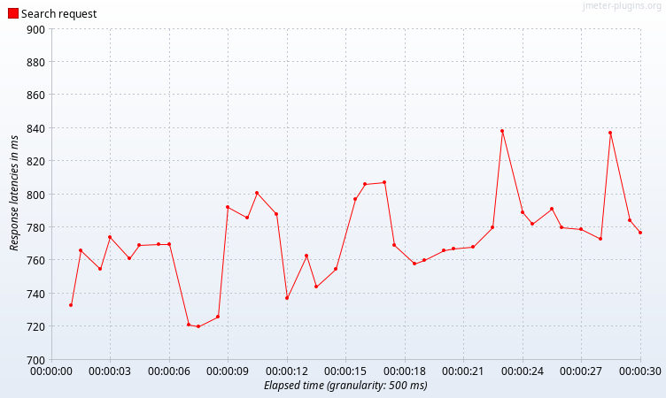
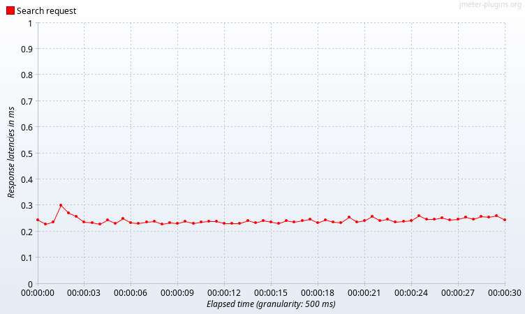

# Отчет по домашней работе №2
## Анализ производительности запросов до оптимизации по индексам

Рисунок 1. Transactions per Second


Рисунок 2. Response Latencies Over Time


От количества конкурентных запросов производительность не поменялась

## Анализ производительности запросов с индексом btree

Создаем индекс btree:
```sql
create index user_first_name_second_name_index
    on public."User" (first_name, second_name);
```
Рисунок 1. Transactions per Second


Рисунок 2. Response Latencies Over Time


Вывод: ситуация не изменилась

## Анализ производительности запросов с индексом gin

Создаем поле tsvector
```sql
create index User_name_index
    on "User" USING GIN (to_tsvector('english', first_name || ' ' || second_name));
```
Рисунок 1. Transactions per Second


Рисунок 2. Response Latencies Over Time


Explain после индексов:
```sql
Sort  (cost=140.84..140.90 rows=25 width=92) (actual time=0.094..0.094 rows=3 loops=1)
  Sort Key: id
  Sort Method: quicksort  Memory: 25kB
"  ->  Bitmap Heap Scan on ""User""  (cost=30.14..140.26 rows=25 width=92) (actual time=0.078..0.081 rows=3 loops=1)"
"        Recheck Cond: ((to_tsvector('english'::regconfig, ((first_name || ' '::text) || second_name)) @@ '''rudi'''::tsquery) AND (to_tsvector('english'::regconfig, ((first_name || ' '::text) || second_name)) @@ '''rosenbaum'''::tsquery))"
        Heap Blocks: exact=3
        ->  Bitmap Index Scan on user_name_index  (cost=0.00..30.13 rows=25 width=0) (actual time=0.072..0.072 rows=3 loops=1)
"              Index Cond: ((to_tsvector('english'::regconfig, ((first_name || ' '::text) || second_name)) @@ '''rudi'''::tsquery) AND (to_tsvector('english'::regconfig, ((first_name || ' '::text) || second_name)) @@ '''rosenbaum'''::tsquery))"
Planning Time: 0.317 ms
Execution Time: 0.131 ms

```

Вывод: индекс gin лучше подходит под полнотекстовый поиск 