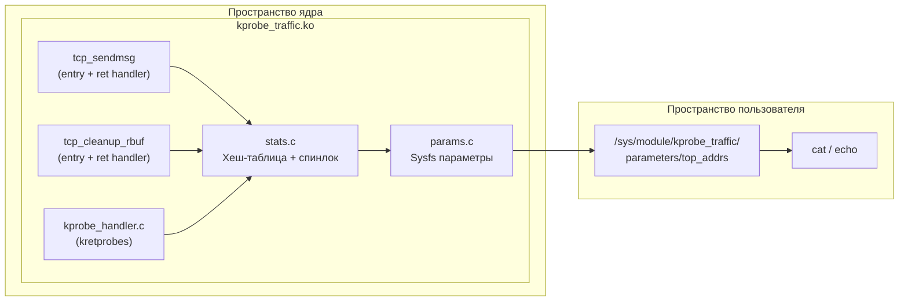
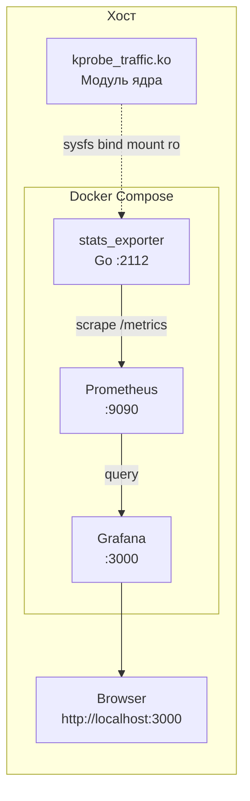

# Тема проектной работы

## "Разработка модуля ядра сбора статистики сетевых подключений - N адресов с самым большим количеством прохождений"

Ядро: **7.0.1**
Исходный код ядра: [https://git.kernel.org/pub/scm/linux/kernel/git/torvalds/linux.git/](https://git.kernel.org/pub/scm/linux/kernel/git/torvalds/linux.git/)
Пример kprobe: [https://git.kernel.org/pub/scm/linux/kernel/git/torvalds/linux.git/tree/samples/kprobes](https://git.kernel.org/pub/scm/linux/kernel/git/torvalds/linux.git/tree/samples/kprobes)

## Make цели

| Цель          | Описание                                                     |
|---------------|--------------------------------------------------------------|
| `build`       | Сборка модуля ядра (`make -C KERNEL_DIR M=$PWD modules`)     |
| `run`         | Загрузка модуля через `insmod`                               |
| `remove`      | Выгрузка модуля через `rmmod`                                |
| `install`     | Копирование модуля в `/lib/modules/`, `depmod` + `modprobe`  |
| `uninstall`   | `modprobe -r`, удаление `.ko`, `depmod`                      |
| `clean`       | Очистка артефактов сборки                                    |
| `format`      | Форматирование `.c`/`.h` файлов через `clang-format`         |
| `check`       | Проверка успешной сборки модуля                              |
| `restart`     | Цикл `remove` → `build` → `run` → `clean`                   |
| `test`        | Загрузка модуля, вывод `dmesg`, выгрузка модуля              |
| `test-params` | Тест параметров `top_n` и `track_src`, проверка `dmesg`    |
| `deploy`      | Загрузка модуля + запуск `stats_exporter` docker-compose     |
| `deploy-down` | Остановка `stats_exporter` docker-compose                    |

## Параметры модуля

| Параметр      | Тип    | Доступ | По умолчанию | Описание                                         |
|---------------|--------|--------|-------------|--------------------------------------------------|
| `top_n`       | int    | 0644   | 10          | Количество top сессий для вывода                 |
| `top_addrs`   | string | 0444   | —           | Список top N сессий (только чтение)              |

## Архитектура модуля

## Архитектура развёртывания

