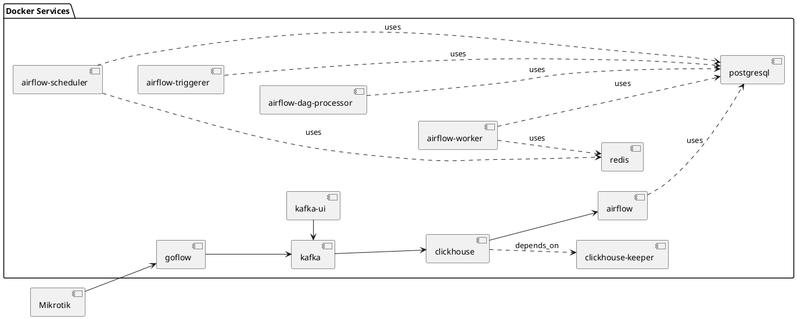

# Report

## Анализ и визуализация данных по трафику сетевого устройства, используя Netflow протокол и БД Clickhouse

Инструкция по запуску:

* Создать сеть docker для объединения сетей двух docker-compose:
```shell
docker network create final_project_default
```

* Установить Apache Superset:
```shell
git clone https://github.com/apache/superset.git
# В файле `docker-compose-light.yml` прописать секцию network (или скопировать из текущего репозитория [docker-compose-light.yml](docker-compose-light.yml)) :
network:
  name: final_project_default

docker compose up -f docker-compose-light.yml

# Выполнить в контейнере superset:
docker compose exec superset `pip install clickhouse-connect`
```

* Выполнить команду `docker-compose up -d` в текущем репозитории
* Настроить сетевое устройство для отправки Netflow данных на порт 6343 сервиса goflow.
* зайти на панель superset http://localhost:8080/
* Выполнить миграцию базы: [create.sh](fs/volumes/clickhouse/create.sh)


