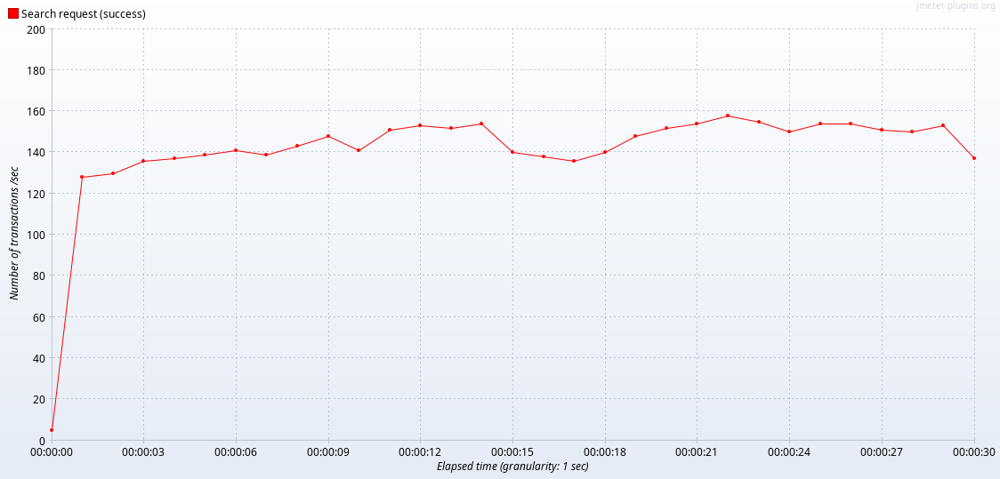
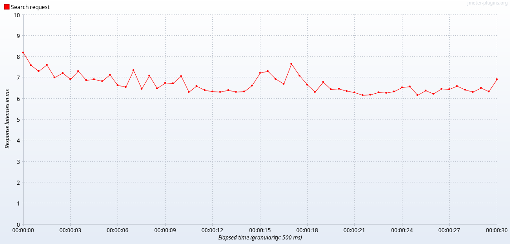
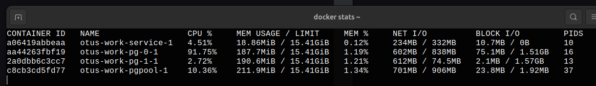
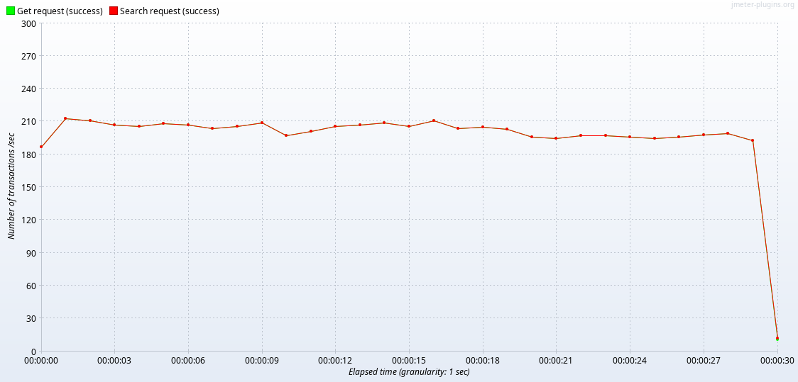
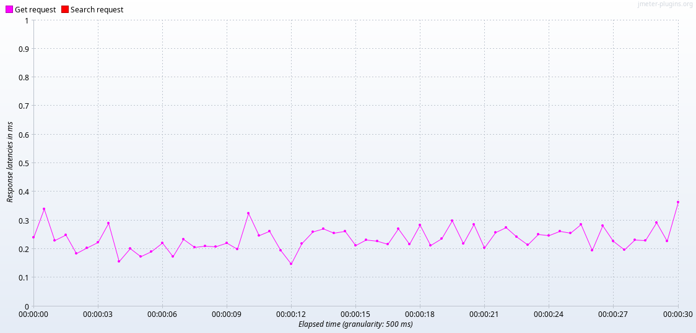
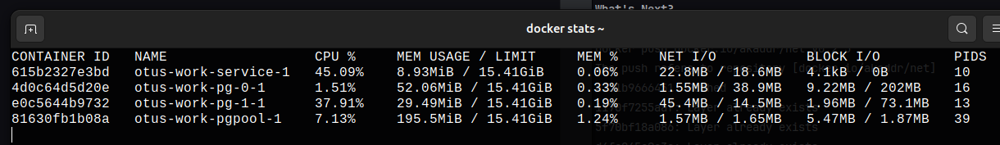
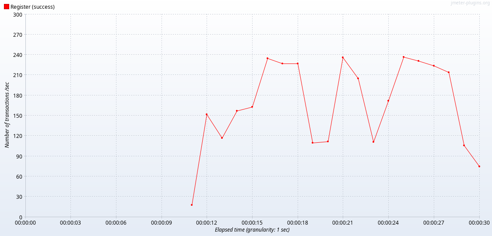

# Домашнее задание
## Репликация

Для тестирования использовались два запроса:
```
[GIN] 2024/04/14 - 06:34:41 | 200 |     187.722µs |      172.21.0.1 | GET      "/user/get/47ca8010-3685-40f1-baf2-9bebd81f364a" 
[GIN] 2024/04/14 - 06:34:41 | 200 |    6.612711ms |      172.21.0.1 | GET      "/user/search?first_name=Rudy&last_name=Rosenbaum"
```

### Конфигурация один мастер - один слейв запрос на мастер.

Рисунок 1 - Transactions per Second


Рисунок 2 Response Latencies Over Time


Рисунок 3 - docker stats (потребление ресурсов)


# переносим запросы на чтение со слейва.
Рисунок 4 - Transactions per Second


Рисунок 5 Response Latencies Over Time


Рисунок 6 - docker stats (потребление ресурсов)


### Настроить 2 слейва и 1 мастер. Включить потоковую репликацию.
Для каждой ноды установили `- POSTGRESQL_NUM_SYNCHRONOUS_REPLICAS=2`

Рисунок 7 - Результаты тестирования в режиме записи и синхронной репликации
